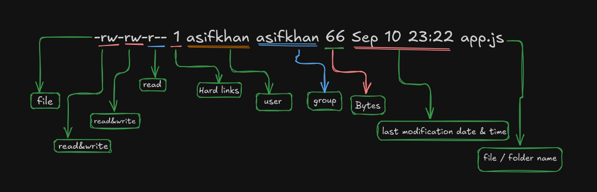

# File permissions

## Types of permissions

- Read
- Write
- Execute

> When create a directory, the computer **allocates** `4KB` space in memory.

> When we create an user in `UNIX` **operating system**, along with that a group is also created.

```bash
-rw-rw-r-- 1 asifkhan asifkhan 66 Sep 10 23:22 app.js
```

1. **-** : file.
2. **d** : directory.
3. **l** : symbolic link.

`rw-` : Group of three characters (Read and write)
`rw-` : Group of three characters (Read and write)
`r--` : Group of three characters (Read)

```bash
-rwxrwxr-x 1 asifkhan asifkhan 25 Sep 10 23:27 index.ts
```

1. **-** : file
2. **rwx** : (Read, Write, and Execute)
3. **rwx** : (Read, Write, and Execute)
4. **-x** : (Execute)



**Grant permission to the file / directory**

`chmod +x app.js`

> `+` : To grant permission `x` : execute permission

**Remove permission to the file / directory**

`chmod -w file.sh`

> `-` : To remove permission `w` : write permission
